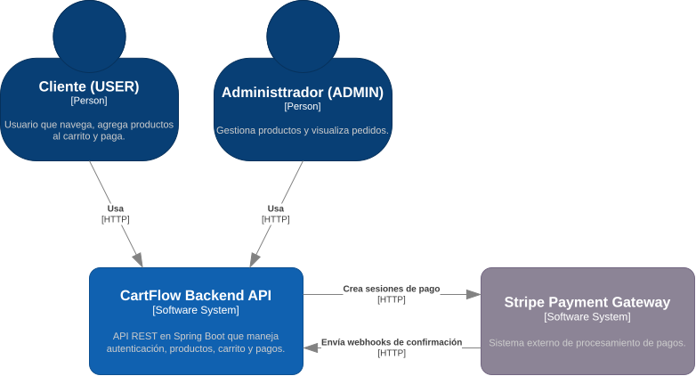

# 3. Contexto y Alcance

## Descripción General

Esta sección define los límites de CartFlow API, identificando sus socios de comunicación externos e interfaces. Distingue entre el contexto de negocio (interacciones específicas del dominio) y el contexto técnico (protocolos, canales y formatos de comunicación).

## Contexto de Negocio

CartFlow API interactúa con actores humanos y sistemas externos, cada uno cumpliendo un rol:

- **Visitante**: explora el catálogo público de productos y consulta el detalle sin autenticarse.
- **Cliente (USER)**: se registra, verifica su cuenta, inicia sesión, gestiona su carrito y paga.
- **Administrador (ADMIN)**: gestiona el catálogo de productos y consulta los pedidos de la plataforma.
- **Stripe**: pasarela externa que procesa el pago y notifica el resultado mediante webhooks.
- **Servicio de Email**: sistema externo (Mailtrap en desarrollo / Gmail SMTP en producción) que entrega los correos de verificación de cuenta.

### Diagrama de Contexto (C4 - Nivel 1)

Vista detallada de los actores y sistemas externos que rodean a CartFlow API. Las flechas indican el protocolo de comunicación (`HTTPS` para APIs web, `SMTP` para correo).

    

> Fuente editable: [`docs/diagrams/DiagramaContexto.drawio`](../diagrams/DiagramaContexto.drawio).

## Contexto Técnico

Los canales, protocolos y formatos de comunicación entre CartFlow API y sus contrapartes externas son:

| Contraparte | Canal | Protocolo / Formato | Autenticación |
| :--- | :--- | :--- | :--- |
| **Visitante, Cliente, Admin** | HTTP(S) | JSON REST | JWT (`Authorization: Bearer <token>`) en endpoints protegidos |
| **MariaDB** | JDBC | SQL | Usuario/contraseña configurados en `application.properties` |
| **Stripe** | HTTPS | REST JSON | API Key secreta en variables de entorno |
| **Email Service** | SMTP | SMTP sobre TLS | Usuario/contraseña (Mailtrap en desarrollo, Gmail App Password en producción) |

### Detalles por canal

- **API HTTP/JSON**: los actores consumen la API REST sobre HTTP(S). La autenticación viaja como `Authorization: Bearer <JWT>`. Los endpoints públicos (catálogo, detalle de producto) no requieren autenticación.
- **Persistencia JDBC**: la API lee y escribe en MariaDB a través del driver JDBC vía Spring Data JPA.
- **Pasarela de pago HTTPS**: la API crea sesiones de pago con Stripe (`POST /v1/checkout/sessions`) y recibe webhooks de confirmación (`POST /api/payments/webhook`) por HTTPS.
- **SMTP**: la API envía correos transaccionales (verificación de cuenta, reenvío de verificación) al servicio de email mediante SMTP sobre TLS.

## Motivación

Comprender el contexto de negocio y técnico asegura que todas las dependencias externas estén gestionadas y que las interacciones de CartFlow API con otros sistemas sean claras. La documentación adecuada de estas interfaces es crítica para evitar malentendidos en la integración con Stripe y con el servicio de correo.

---

## Notas de diseño

- **El Diagrama de Contenedores (C4 - Nivel 2)** se documenta en la [Sección 5: Vista de Bloques de Construcción](./05_vista_de_componentes.md), donde se descompone la estructura interna del sistema.
- **El Diagrama de Componentes (C4 - Nivel 3)** también se documenta en la Sección 5.
- La vista de despliegue (entornos, infraestructura) se documentará en la [Sección 7](./07_vista_de_despliegue.md) cuando el proyecto sea desplegado.