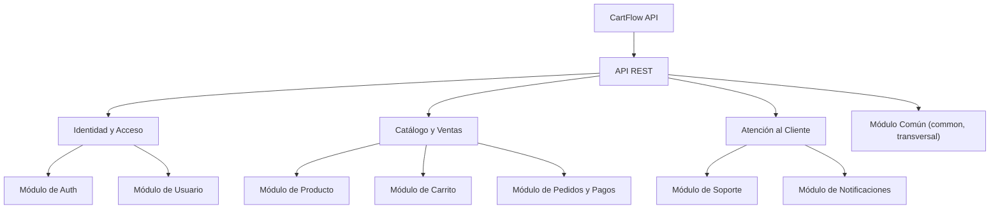

# 5. Vista de Bloques de Construcción

## Descripción General

La Vista de Bloques de Construcción proporciona una descomposición estática de CartFlow API, mostrando la estructura jerárquica de sus componentes. Esta sección desglosa el sistema en "cajas blancas" (contenedores de alto nivel) que contienen "cajas negras" (componentes) y describe cómo se organizan.

## Nivel 1: Contenedores (C4 - Nivel 2)

En el nivel más alto, CartFlow API se compone de los siguientes bloques desplegables y de datos:

- **CartFlow Backend** ✅: aplicación Spring Boot 4 / Java 21 que contiene la lógica de negocio, la seguridad y los controladores REST.
- **Base de Datos MariaDB** ✅: almacena usuarios, productos, carritos, pedidos y tickets de soporte. Accedida por JDBC desde el backend.
- **Stripe Payment Gateway** 🔜: sistema externo de procesamiento de pagos; el backend crea sesiones y recibe webhooks.
- **Email Service** 🔜: sistema externo de envío de correos transaccionales vía SMTP.

    

> Fuente editable: [`docs/diagrams/DiagramaContenedor.drawio`](../diagrams/DiagramaContenedor.drawio).

## Nivel 2: Componentes (C4 - Nivel 3)

El contenedor **API REST** se descompone en componentes organizados por dominio funcional.

### Identidad y Acceso

**Módulo de Auth** ✅ (parcial)
- *Responsabilidad*: registro, login y generación de JWT.
- *Actualidad*: el registro (`AuthService.register`) y la generación de token (`JwtService`) están implementados; el login y la verificación de correo están planificados.
- *Depende de*: `UserRepository`, `PasswordEncoder`, `JwtService`.

**Módulo de Usuario** ✅
- *Responsabilidad*: gestión de la tabla `user`.
- *Actualidad*: `UserEntity`, `Role` (`ADMIN`, `USER`) e `IUserRepository` implementados.

### Catálogo y Ventas

**Módulo de Producto** 🔜
- *Responsabilidad*: CRUD de productos, catálogo público activo y detalle.
- *Depende de*: tabla `product` (con `is_active`, auditoría `created_by`/`updated_by`).

**Módulo de Carrito** 🔜
- *Responsabilidad*: gestión de `cart` y `cart_item`, validación de stock y cálculo de totales.
- *Depende de*: módulo de Producto (precio y stock) y seguridad JWT.

**Módulo de Pedidos y Pagos** 🔜
- *Responsabilidad*: gestión de `order` y `order_item`, creación de sesiones de Stripe (Stripe SDK) y procesamiento de webhooks.
- *Depende de*: módulo de Carrito (para vaciar/leer), módulo de Producto (descuento de stock) y Stripe.

### Atención al Cliente

**Módulo de Soporte** 🔜
- *Responsabilidad*: gestión de `support_ticket` y `support_ticket_reply`; conversación bidireccional cliente-admin, asignación y cambio de estados.
- *Depende de*: módulo de Usuario (autor), módulo de Pedidos (validar `order_id`) y seguridad JWT.

**Módulo de Notificaciones** 🔜
- *Responsabilidad*: envío de correos transaccionales (verificación de cuenta, confirmación de compra, notificaciones de tickets) vía `JavaMailSender`.
- *Depende de*: Email Service (SMTP).

    

> Fuente editable: [`docs/diagrams/DiagramaComponente.drawio`](../diagrams/DiagramaComponente.drawio).

> **Nota:** En el diagrama de componentes se omitió la flecha hacia MariaDB para reducir ruido visual. Todos los componentes de la API acceden a la base de datos vía JDBC/JPA a través de sus respectivos repositorios. La persistencia se documenta con detalle en el Nivel 1 (Contenedores).

### Módulos transversales (no representados como componentes)

**`common`** (transversal) ✅
- *Responsabilidad*: configuración y utilidades compartidas por todos los módulos.
- *Contiene*: `SecurityConfig`, `ApplicationConfig`, `JwtService`, `JwtAuthenticationFilter`, `CartflowException`, `ErrorResponse`, `GlobalExceptionHandler`.
- *Nota*: no se representa como componente en el diagrama porque es infraestructura compartida, no un dominio funcional.

## Jerarquía de Bloques

## Motivación

Descomponer CartFlow API en bloques de construcción permite una mejor modularidad, mantenibilidad y escalabilidad. Al organizar el sistema en módulos por feature con dependencias claras, es más fácil implementar las épicas pendientes sin interrumpir lo ya construido.

Los tres grupos funcionales (Identidad, Ventas, Atención al Cliente) reflejan los tres grandes flujos de negocio del e-commerce: quién es el usuario, qué compra y cómo se le atiende después de la compra.
