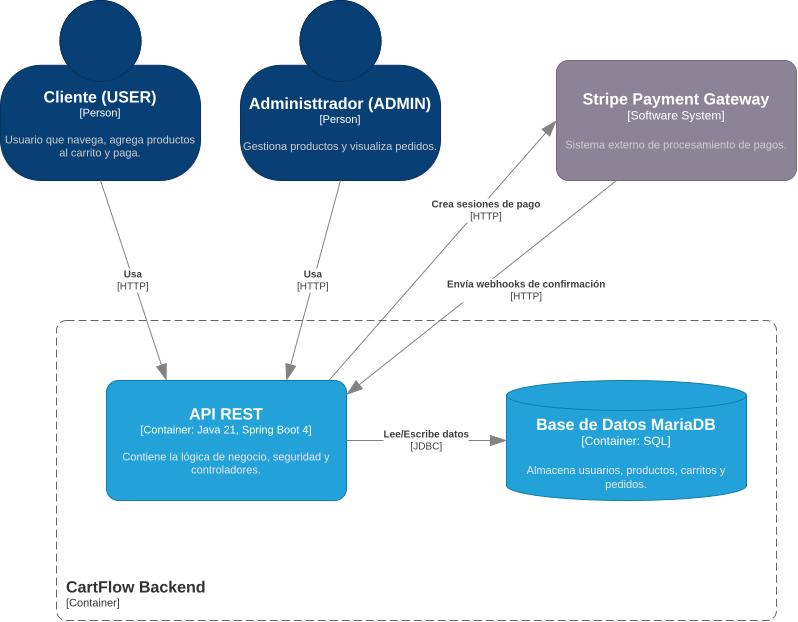
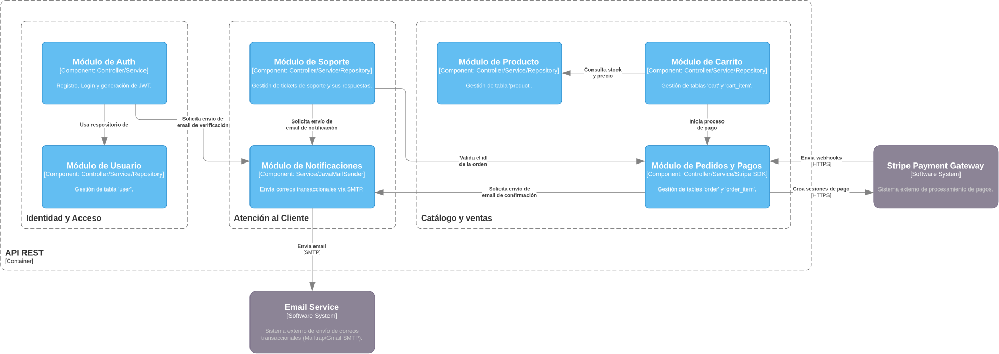
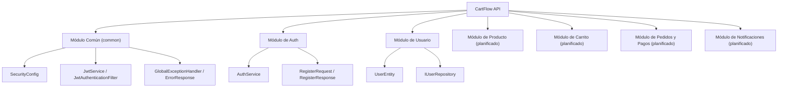

# 5. Vista de Bloques de Construcción

## Descripción General

La Vista de Bloques de Construcción proporciona una descomposición estática de CartFlow API, mostrando la estructura jerárquica de sus componentes. Esta sección desglosa el sistema en "cajas blancas" (contenedores de alto nivel) que contienen "cajas negras" (componentes) y describe cómo se organizan.

## Nivel 1: Contenedores (C4 - Nivel 2)

En el nivel más alto, CartFlow API se compone de los siguientes bloques desplegables y de datos:

- **CartFlow Backend** ✅: aplicación Spring Boot 4 / Java 21 que contiene la lógica de negocio, la seguridad y los controladores REST.
- **Base de Datos MariaDB** ✅: almacena usuarios, productos, carritos y pedidos. Accedida por JDBC desde el backend.
- **Stripe Payment Gateway** 🔜: sistema externo de procesamiento de pagos; el backend crea sesiones y recibe webhooks.
- **Email Service** 🔜: sistema externo de envío de correos transaccionales vía SMTP.

    

> Fuente editable: [`docs/diagrams/DiagramaContenedor.drawio`](../diagrams/DiagramaContenedor.drawio).

## Nivel 2: Componentes (C4 - Nivel 3)

El contenedor **CartFlow Backend** se descompone en los siguientes componentes:

1. **Módulo de Auth** ✅ (parcial)
   - *Responsabilidad*: registro, login y generación de JWT.
   - *Actualidad*: el registro (`AuthService.register`) y la generación de token (`JwtService`) están implementados; el login y la verificación por correo están planificados.
   - *Depende de*: `UserRepository`, `PasswordEncoder`, `JwtService`.

2. **Módulo de Usuario** ✅
   - *Responsabilidad*: gestión de la tabla `user`.
   - *Actualidad*: `UserEntity`, `Role` (`ADMIN`, `USER`) e `IUserRepository` implementados.

3. **Módulo de Producto** 🔜
   - *Responsabilidad*: CRUD de productos, catálogo público activo y detalle.
   - *Depende de*: tabla `product` (con `is_active`, auditoría `created_by`/`updated_by`).

4. **Módulo de Carrito** 🔜
   - *Responsabilidad*: gestión de `cart` y `cart_item`, validación de stock y cálculo de totales.
   - *Depende de*: módulo de Producto (precio y stock) y de la seguridad JWT.

5. **Módulo de Pedidos y Pagos** 🔜
   - *Responsabilidad*: gestión de `order` y `order_item`, creación de sesiones de Stripe (Stripe SDK) y procesamiento de webhooks.
   - *Depende de*: módulo de Carrito (para vaciar/leer), módulo de Producto (descuento de stock) y Stripe.

6. **Módulo de Notificaciones** 🔜
   - *Responsabilidad*: envío de correos transaccionales (verificación, recuperación) vía `JavaMailSender`.
   - *Depende de*: Email Service (SMTP).

7. **Módulo Común (`common`)** ✅
   - *Responsabilidad*: configuración transversal y utilidades.
   - *Contiene*: `SecurityConfig`, `ApplicationConfig`, `JwtService`, `JwtAuthenticationFilter`, `CartflowException`, `ErrorResponse`, `GlobalExceptionHandler`.

    

> Fuente editable: [`docs/diagrams/DiagramaComponente.drawio`](../diagrams/DiagramaComponente.drawio).

## Jerarquía de Bloques

## Motivación

Descomponer CartFlow API en bloques de construcción permite una mejor modularidad, mantenibilidad y escalabilidad. Al organizar el sistema en módulos por feature con dependencias claras, es más fácil implementar las épicas pendientes sin interrumpir lo ya construido.
