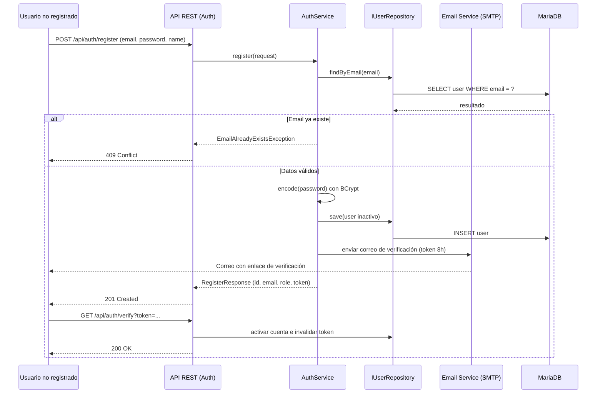
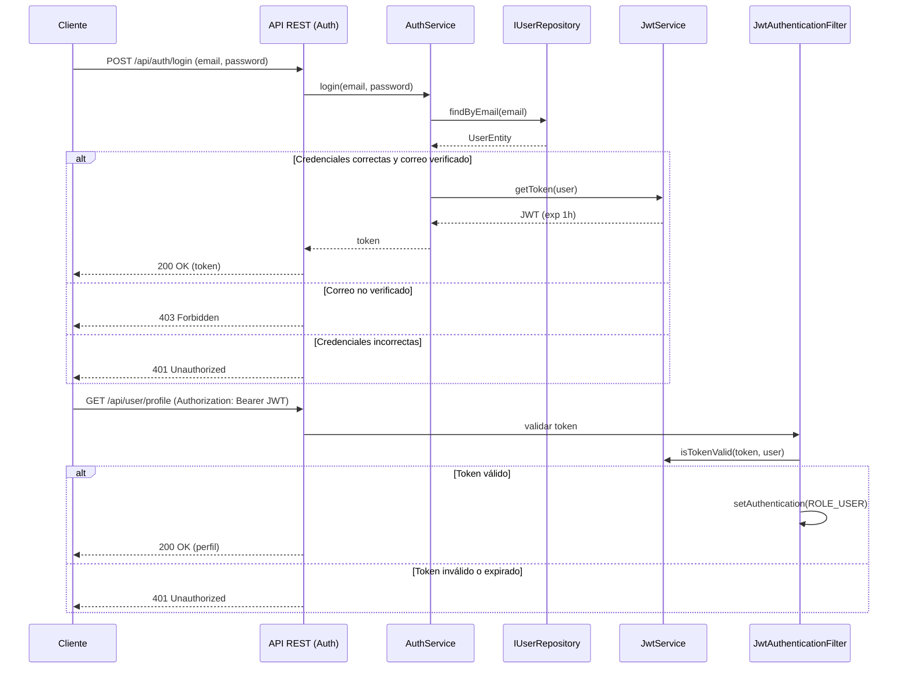
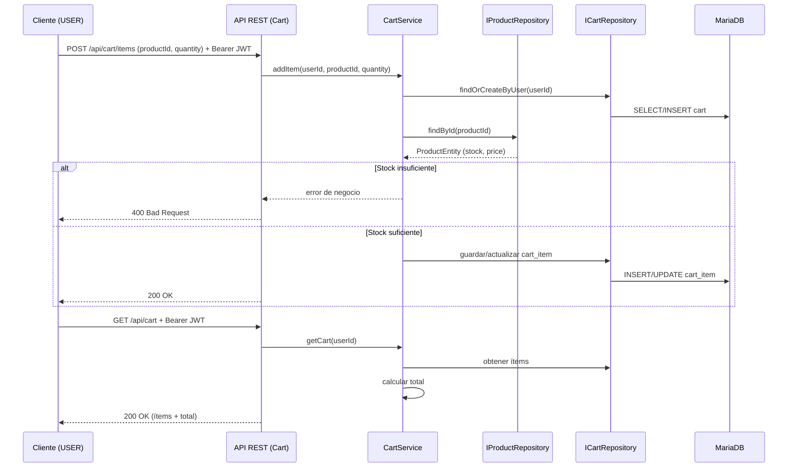
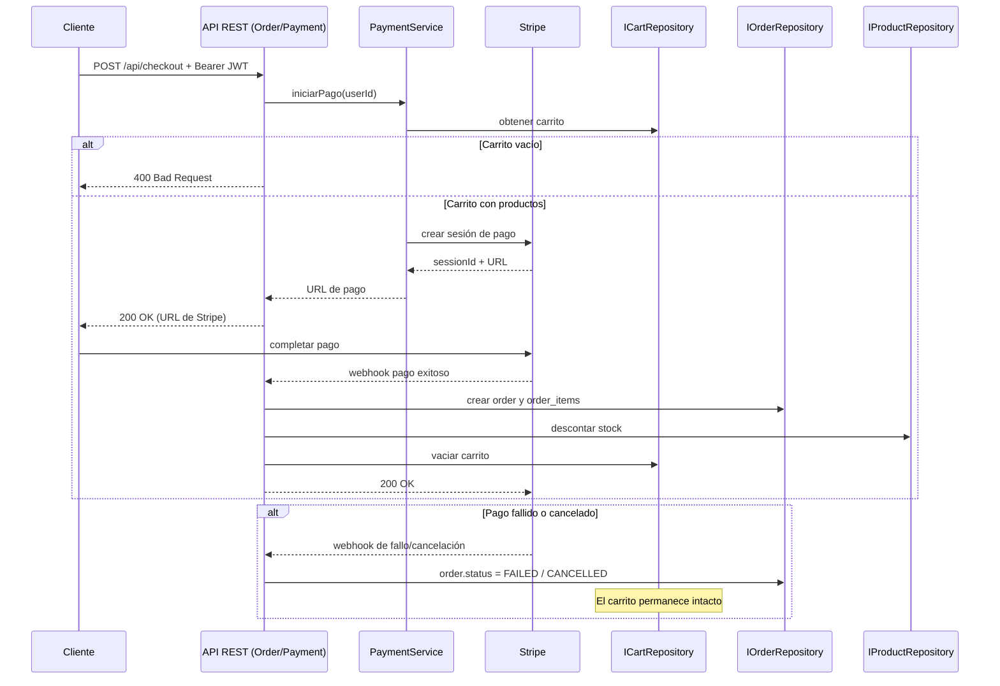

# 6. Vista de Tiempo de Ejecución

## Descripción General

La Vista de Tiempo de Ejecución describe el comportamiento dinámico y las interacciones entre los bloques de construcción de CartFlow API durante escenarios clave. Los escenarios siguientes están definidos en las historias de usuario ([`epicas-y-hu.md`](../epicas-y-hu.md)); los que aún no están implementados se marcan como **🔜 Planificado (diseño propuesto)** y sirven como especificación de referencia.

## Escenario 1: Registro y Verificación de Cuenta (HU-001, HU-017)

- **Estado**: ✅ Registro implementado (sin envío de correo) · 🔜 Verificación planificada.
- **Desencadenante**: un usuario no registrado envía sus datos de registro.
- **Secuencia**: el backend valida los datos, verifica que el email no exista, crea la cuenta **inactiva**, genera un token de verificación con expiración de 8 horas, envía el correo y responde `201`. Al hacer clic en el enlace, la cuenta se activa y el token se invalida (uso único).
- **Gestión de Errores**: email ya registrado → `409`; email inválido o contraseña < 8 caracteres → `400`.

## Escenario 2: Inicio de Sesión y Acceso a Endpoint Protegido (HU-002, HU-003)

- **Estado**: 🔜 Planificado (diseño propuesto).
- **Desencadenante**: un usuario verificado envía sus credenciales.
- **Secuencia**: el backend valida las credenciales y que el correo esté verificado, y devuelve un JWT con expiración de 1 hora. En peticiones posteriores, `JwtAuthenticationFilter` valida el token y establece la autenticación.
- **Gestión de Errores**: correo no verificado → `403`; credenciales incorrectas → `401`; token expirado o ausente → `401`.

## Escenario 3: Gestión del Carrito con Validación de Stock (HU-009, HU-010, HU-012)

- **Estado**: 🔜 Planificado (diseño propuesto).
- **Desencadenante**: un cliente autenticado agrega un producto a su carrito.
- **Secuencia**: el backend identifica al usuario por el JWT, recupera o crea su carrito activo, valida el stock disponible y guarda el `cart_item`; si el producto ya estaba, actualiza la cantidad. Al consultar el carrito, calcula el total.
- **Gestión de Errores**: usuario no autenticado → `401`; stock insuficiente o cantidad > stock → `400`.

## Escenario 4: Checkout en Stripe y Webhook de Pago (HU-013, HU-014, HU-015)

- **Estado**: 🔜 Planificado (diseño propuesto).
- **Desencadenante**: el cliente inicia el pago de su carrito.
- **Secuencia**: si el carrito no está vacío, el backend crea una sesión de pago en Stripe y devuelve la URL. Cuando Stripe confirma el pago por webhook, el sistema crea el pedido (`order` y `order_item`), descuenta el stock y vacía el carrito.
- **Gestión de Errores**: carrito vacío → `400`; pago fallido o cancelado → pedido en estado `FAILED`/`CANCELLED` y carrito intacto.

## Motivación

Esta vista es esencial para comprender las interacciones dinámicas de CartFlow API durante operaciones críticas como el registro, la autenticación, la gestión del carrito y el pago. Al documentar estos escenarios a partir de las historias de usuario, el equipo cuenta con una especificación de referencia antes de implementar cada épica.
