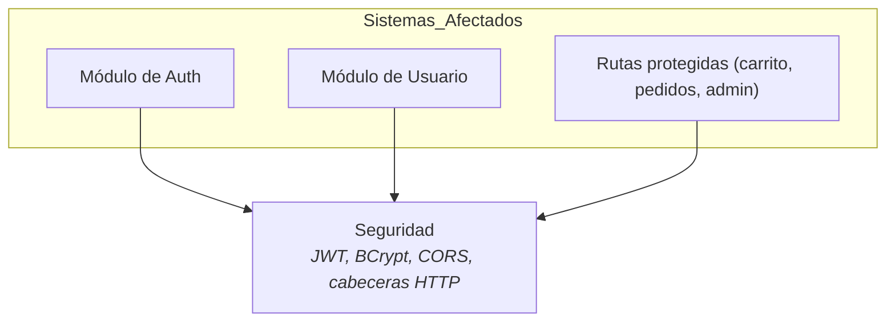
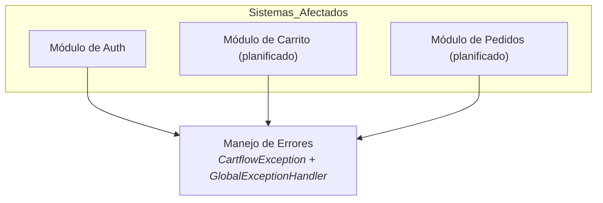
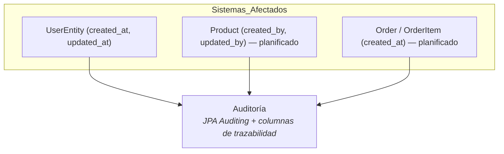
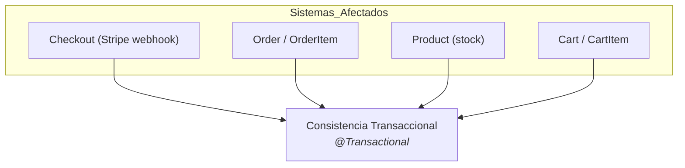
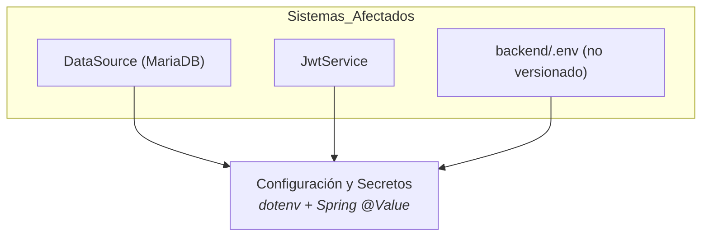
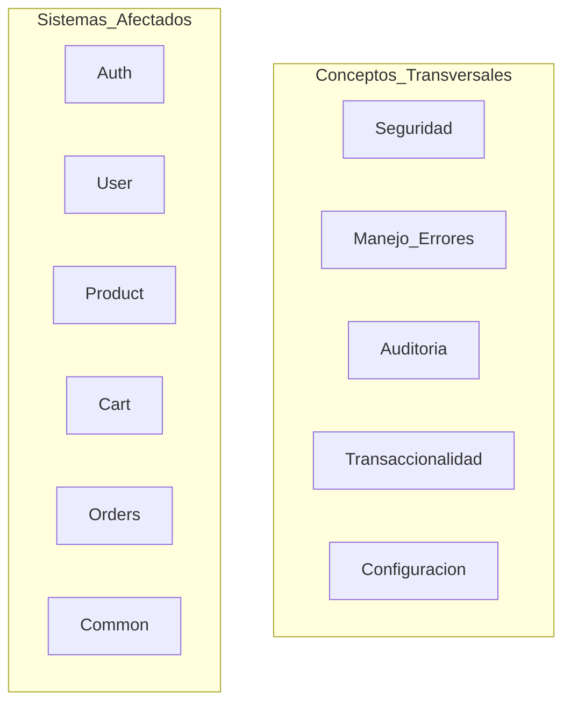

# 8. Conceptos Transversales

## Descripción General

Los conceptos transversales definen los estándares técnicos, principios y soluciones aplicados en toda la arquitectura de CartFlow API. Estos principios afectan a múltiples componentes o capas, asegurando un enfoque unificado.

## Principales Conceptos Transversales

### 1. **Seguridad** ✅

El acceso a las rutas protegidas se controla con JWT. `JwtAuthenticationFilter` intercepta cada petición, valida el token, busca al usuario y construye sus authorities con prefijo `ROLE_` a partir del rol almacenado (no del claim). La configuración es stateless y las contraseñas se almacenan con hash BCrypt. Se aplican además cabeceras de seguridad (CSP, HSTS, `X-Frame-Options: DENY`, `X-Content-Type-Options`) y una política CORS explícita.

### 2. **Manejo de Errores y Validación** ✅

Las excepciones de negocio heredan de `CartflowException`, que transporta un `HttpStatus`. `GlobalExceptionHandler` (`@RestControllerAdvice`) las traduce a una respuesta uniforme `ErrorResponse` (con timestamp, status, error, mensaje, path y detalles). La validación de entrada con Jakarta Validation produce errores `400` con el detalle de cada campo inválido.

### 3. **Auditoría** ✅ (parcial)

Las entidades usan JPA Auditing (`@CreatedDate`, `@LastModifiedDate`) para registrar `created_at` y `updated_at`. La tabla `product` añade `created_by` y `updated_by` para trazabilidad de quién modifica el catálogo.

### 4. **Consistencia Transaccional** 🔜

El flujo de compra debe ser atómico: al confirmarse el pago se crean `order` y `order_item`, se descuenta el stock y se vacía el carrito dentro de una misma transacción. El precio unitario se "congela" en `order_item.unit_price` para no depender del precio actual del producto.

### 5. **Configuración y Gestión de Secretos** ✅

La configuración sensible se externaliza en `backend/.env`, cargado mediante `springboot4-dotenv`. Ninguna credencial (`DB_PASSWORD`, `jwt.key`) se versiona. Las claves de configuración son `DB_URL`, `DB_USERNAME`, `DB_PASSWORD`, `jwt.key` (HMAC en Base64) y `jwt.expiration`.

## Vista Consolidada de Conceptos Transversales

El siguiente diagrama resume, a alto nivel, los sistemas afectados y los conceptos transversales definidos. Las relaciones específicas se documentan en detalle en cada subsección.

## Motivación

Estos conceptos establecen un enfoque coherente en estándares técnicos y prácticas de diseño, mejorando la seguridad, la trazabilidad y la integridad de datos de CartFlow API. Adoptarlos de forma transversal evita duplicar lógica y facilita la implementación consistente de las épicas pendientes.
