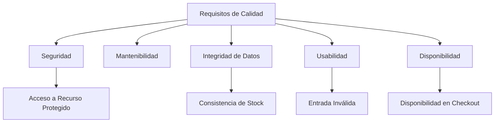
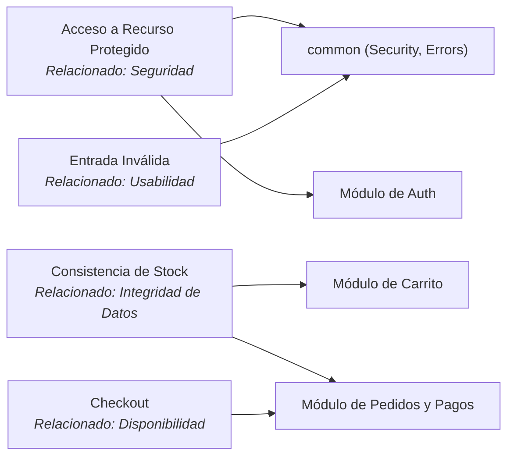

# 10. Requisitos de Calidad

## Descripción General

Esta sección detalla los objetivos de calidad de CartFlow API. Están expresados de forma **cualitativa**: no existe todavía un entorno de pruebas de rendimiento ni instrumentación de métricas, por lo que las cifras concretas se marcan como `[Métrica pendiente de definir]`. Los escenarios que provienen de las historias de usuario sí tienen criterios de aceptación funcionales verificables.

## Objetivos de Calidad

1. **Seguridad**: impedir el acceso no autorizado a operaciones protegidas y no exponer credenciales ni datos de pago.
   - *Métrica*: `[Métrica pendiente de definir]` (p. ej., tasa de detección de accesos indebidos, cobertura de rutas protegidas).
2. **Mantenibilidad**: facilitar la evolución por features y mantener la documentación y las convenciones al día.
   - *Métrica*: `[Métrica pendiente de definir]` (p. ej., cobertura de tests, complejidad ciclomática).
3. **Integridad de datos**: garantizar consistencia entre stock, carrito y pedidos, evitando sobreventa.
   - *Métrica*: `[Métrica pendiente de definir]` (p. ej., número de pedidos con stock inconsistente).
4. **Usabilidad / Experiencia**: ofrecer respuestas claras ante errores y permitir la exploración del catálogo sin fricción.
   - *Métrica*: `[Métrica pendiente de definir]`.
5. **Disponibilidad / Confiabilidad**: mantener la API operativa durante las operaciones de compra.
   - *Métrica*: `[Métrica pendiente de definir]` (p. ej., uptime, presupuesto de error).

## Escenarios de Calidad

### Escenario 1: Acceso a Recurso Protegido
- **Desencadenante**: una petición sin token válido (o con rol insuficiente) intenta acceder a una ruta protegida.
- **Resultado Esperado**: el sistema responde `401` (sin token) o `403` (rol incorrecto) y deniega el acceso.
- **Métrica**: `[Métrica pendiente de definir]` — criterio funcional verificable según HU-009 y Épica 2.

### Escenario 2: Consistencia de Stock en la Compra
- **Desencadenante**: dos o más clientes compran simultáneamente la misma unidad limitada de un producto.
- **Resultado Esperado**: el stock nunca queda negativo y solo se confirman los pedidos posibles.
- **Métrica**: `[Métrica pendiente de definir]` — criterio funcional de la Épica 4.

### Escenario 3: Retroalimentación ante Entrada Inválida
- **Desencadenante**: se envía una petición con datos inválidos (email malformado, contraseña corta, stock negativo, carrito vacío).
- **Resultado Esperado**: el sistema responde `400` con el detalle del campo inválido mediante `ErrorResponse`.
- **Métrica**: `[Métrica pendiente de definir]` — cubierto funcionalmente por HU-001, HU-004 y HU-013.

### Escenario 4: Disponibilidad durante el Checkout
- **Desencadenante**: fallo o cancelación de un pago en Stripe.
- **Resultado Esperado**: el pedido queda en estado `FAILED`/`CANCELLED` y el carrito permanece intacto, sin afectar el stock.
- **Métrica**: `[Métrica pendiente de definir]` — criterio funcional de HU-015.

## Diagrama de Árbol de Calidad

## Diagrama de Impacto de Escenarios en Sistemas

## Motivación

Al definir estos requisitos de calidad, CartFlow API se orienta hacia operaciones seguras, íntegras y usables. Las métricas cuantitativas quedan explícitamente pendientes hasta que exista instrumentación y entornos de medición.
